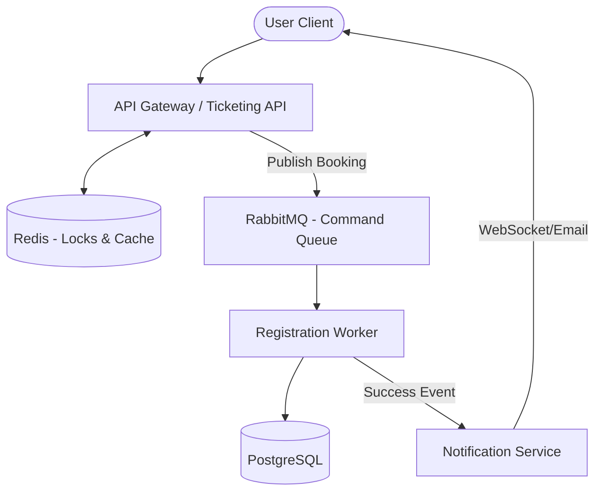
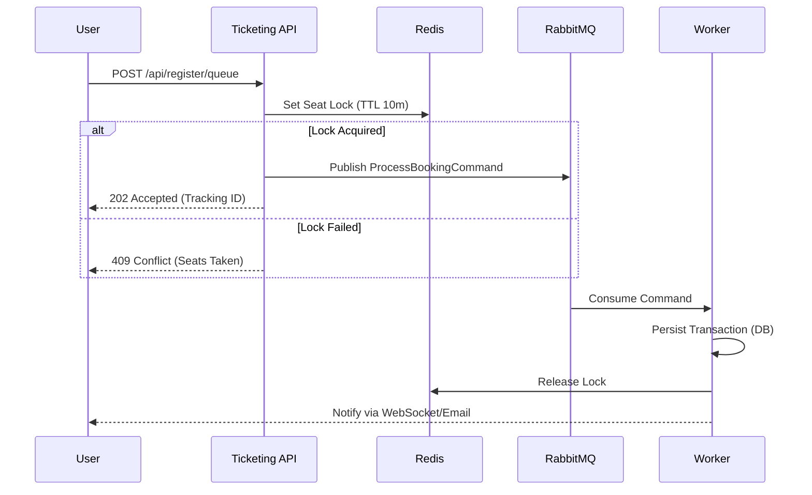

# Event Ticketing Platform

A full-stack, distributed platform designed for **high-concurrency event registration and seat-based ticketing**. Built to handle extreme traffic spikes (like concert flash-sales) while ensuring strong consistency and zero overbooking.

## Key Features

- **High-Concurrency Seat Booking**: Handles thousands of concurrent requests using distributed locking and asynchronous processing.
- **Dual Registration Flows**: 
    - **Simple**: For low-demand events (direct booking).
    - **Queue-based**: For high-demand events (controlled access via RabbitMQ).
- **Seat Locking Mechanism**: Temporary seat reservation (TTL-based) in Redis during the checkout session.
- **Interactive Seating Maps**:
    - **Procedural**: Dynamically generated layouts for movie theatres (Rows/Cols).
    - **SVG-Based**: Complex mapping for stadiums and concert halls.
- **Real-time Notifications**: Instant feedback via WebSocket and email delivery upon booking confirmation.
- **Keycloak Integration**: Secure identity management and role-based access control (RBAC).

---

## Architecture & Technology Stack

The platform follows a modular backend architecture, designed to be microservices-ready.

### Tech Stack
- **Backend**: Java 17, Spring Boot 3.4.1
- **Messaging**: RabbitMQ (Asynchronous command processing)
- **Caching & Locking**: Redis (Seat locks, real-time status)
- **Database**: PostgreSQL (Persistent storage)
- **Auth**: Keycloak (OIDC/JWT)
- **Build System**: Maven (Multi-module)

### Backend Structure
- `shared`: Common enums, exceptions, and messaging contracts.
- `ticketing-api`: The entry point. Handles event discovery, seat locking, and starts the booking session.
- `registration-worker`: The "heavy lifter". Consumes booking commands and persists tickets to the database.
- `notification-service`: Handles email generation (PDF + QR) and real-time updates.

### System Diagram


---

## Registration & Booking Workflow

### Asynchronous Booking Flow
To prevent database bottlenecks during traffic spikes, the booking process is decoupled:

1. **Selection**: User selects seats in the UI.
2. **Lock**: `ticketing-api` acquires a distributed lock in **Redis** for 5-10 minutes.
3. **Queue**: A `ProcessBookingCommand` is sent to **RabbitMQ**.
4. **Processing**: The `registration-worker` consumes the command:
    - Validates the lock is still held by the user.
    - Perists the `Ticket` in **PostgreSQL**.
    - Releases the lock.
5. **Feedback**: The `notification-service` is triggered to send a confirmation.



---

## Getting Started

### Prerequisites
- Java 17+
- Maven 3.8+
- Docker (for PostgreSQL, Redis, and RabbitMQ)

### Local Setup
1. **Clone the repository**:
   ```bash
   git clone https://github.com/AhmedTrb/Event-Ticketing.git
   cd Event-Ticketing/backend
   ```
2. **Spin up Infrastructure**:
   ```bash
   cd infrastructure/docker
   docker-compose up -d
   ```
3. **Build and Run**:
   ```bash
   mvn clean install
   cd ticketing-api && ./mvnw spring-boot:run
   ```

---

## Documentation
- **Postman Collection**: Located in `backend/ticketing-api.postman_collection.json`.
- **Backend Summary**: Detailed entity and DB mapping can be found in `backend-summary.md`.
- **Keycloak Setup**: Check `backend/ticketing-api/KEYCLOAK_SETUP.md`.

